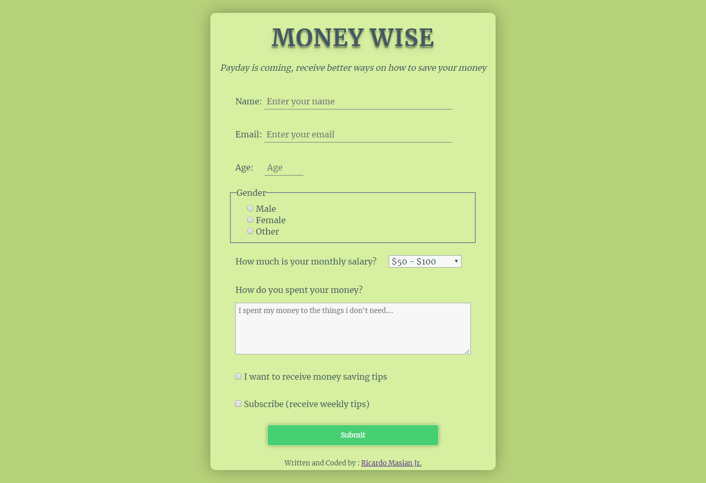

# fcc-survey-form

Build a Survey Form. This is the second project of [FreeCodeCamp Responsive Web Design Certification](https://learn.freecodecamp.org/responsive-web-design/responsive-web-design-projects/build-a-survey-form).

## Live Demonstration

Live project link: <https://codepen.io/rmasianjr/full/OaxvVQ/>

## Screenshots

## Objective

- [x] Build a CodePen.io app that is functionally similar to this: <https://codepen.io/freeCodeCamp/full/VPaoNP>. Fulfill the below user stories and get all of the tests to pass. Give it your own personal style. You can use HTML, JavaScript, and CSS to complete this project. Plain CSS is recommended because that is what the lessons have covered so far and you should get some practice with plain CSS. You can use Bootstrap or SASS if you choose. Additional technologies (just for example jQuery, React, Angular, or Vue) are not recommended for this project, and using them is at your own risk. Other projects will give you a chance to work with different technology stacks like React. We will accept and try to fix all issue reports that use the suggested technology stack for this project. Happy coding!

## User Stories

- [x] I can see a title with `id="title"` in H1 sized text.
- [x] I can see a short explanation with `id="description"` in P sized text.
- [x] I can see a form with `id="survey-form"`.
- [x] Inside the form element, I am required to enter my name in a field with `id="name"`.
- [x] Inside the form element, I am required to enter an email in a field with `id="email"`.
- [x] If I enter an email that is not formatted correctly, I will see an HTML5 validation error.
- [x] If I enter numbers outside the range of the number input, which are defined by the `min` and `max` attributes, I will see an HTML5 validation error.
- [x]  For the name, email, and number input fields inside the form I can see corresponding labels that describe the purpose of each field with the following ids: `id="name-label"`, `id="email-label"`, and `id="number-label"`.
- [x] For the name, email, and number input fields, I can see placeholder text that gives me a description or instructions for each field.
- [x] Inside the form element, I can select an option from a dropdown that has a corresponding `id="dropdown"`.
- [x] Inside the form element, I can select a field from one or more groups of radio buttons. Each group should be grouped using the `name` attribute.
- [x] Inside the form element, I can select several fields from a series of checkboxes, each of which must have a `value` attribute.
- [x] Inside the form element, I am presented with a `textarea` at the end for additional comments.
- [x] Inside the form element, I am presented with a button with `id="submit"` to submit all my inputs.